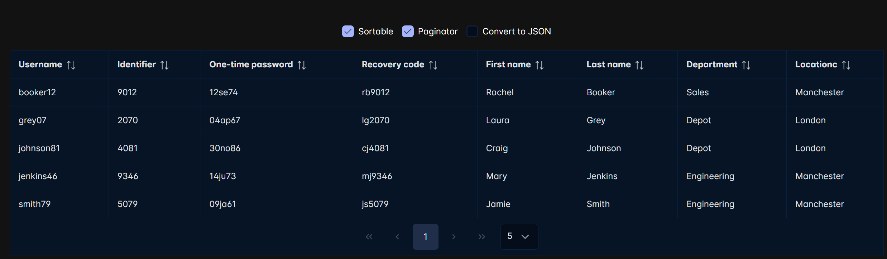
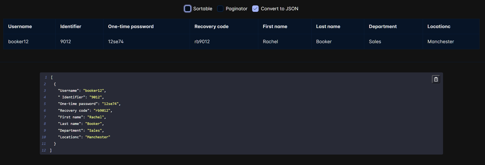

# CSV Viewer 

A simple application for parsing CSV files and displaying them as a table or create a JSON

---

How to run it locally:

1) Run command: `npm install`
2) Run command: `npm run start`

Now application will be accessible in the web browser at `http://localhost:3000`

---

Table view support **sorting** and **pagination** 

Also convert csv to JSON

---

Tool available at <a href="https://lively-rock-0019cda03.4.azurestaticapps.net/">Link</a>