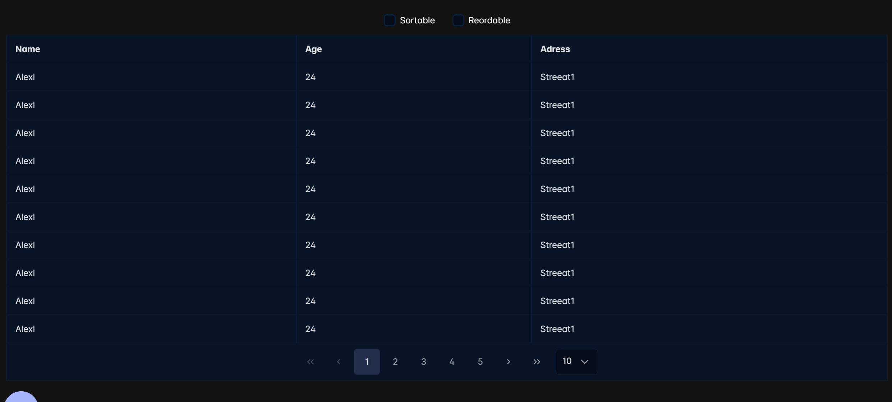

# CSV Viewer 

A simple application for parsing CSV files and displaying them as a table or create a JSON

---

How to run it locally:

1) Run command: `npm install`
2) Run command: `npm run start`

Now application will be accessible in the web browser at `http://localhost:3000`

---

Application supports two different ways:
1) Parse CSV from input or from file
   
2) If one of them selected another one will be disabled
3) After load file/input press **render csv**
   
   Clear option is available for both regimes
4) Table view has two options:
   1) Sortable: Sort any column
   2) Reordable: change header order in table
5) Paginator will appear if csv data records length >= 30
6) Below the table view, exporter button will appear:
   
   1) None -> remove json/c# block
   2) Selected json -> show selected row as json
   3) All to json -> if csv data record less than 100 then show them in code block, else show save dialog window with all data records as json.
   4) All to excel -> export all csv data records to excel format
   5) Create C# model -> create an c# model from csv data

---

Tool available at <a href="https://lively-rock-0019cda03.4.azurestaticapps.net/">Link</a>